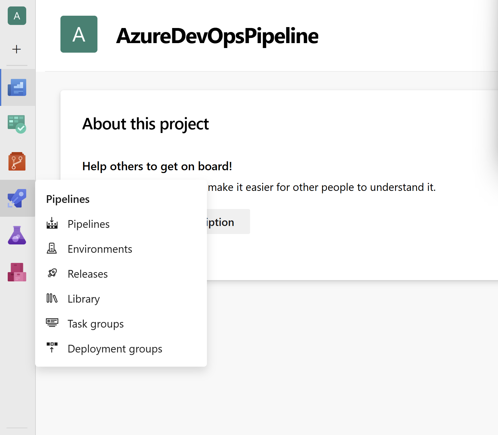
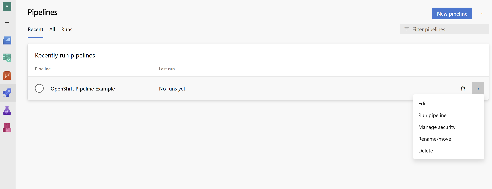
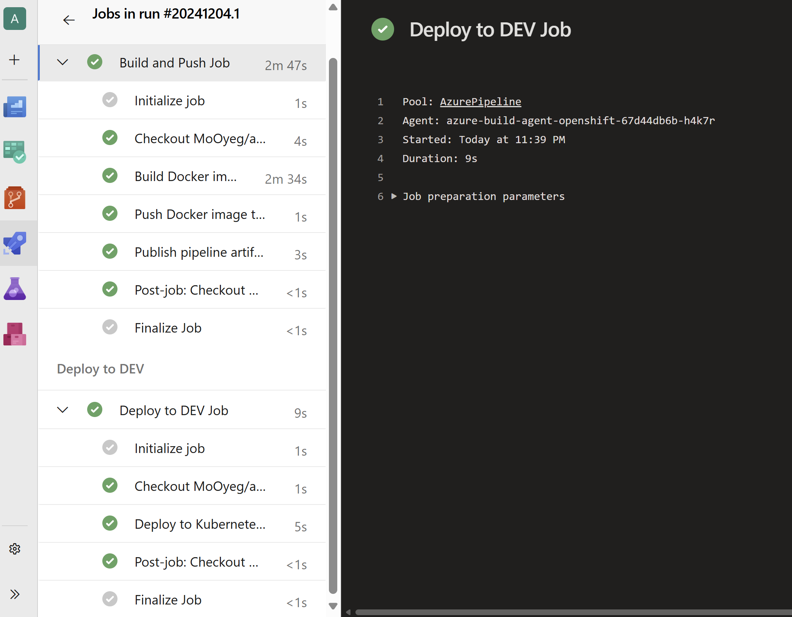

# About
This repo provides Sample Azure DevOps Automation for using Azure DevOps on OpenShift.
It's styled around the steps discussed here
- [Azure DevOps with Managed OpenShift](https://cloud.redhat.com/experts/misc/azure-dev-ops-with-managed-openshift/)
- [Hosting an Azure Pipelines Build Agent in OpenShift](https://www.redhat.com/en/blog/hosting-an-azure-pipelines-build-agent-in-openshift)
It uses Terraform and Helm to deploy the example described above.

## Requirements
  - Terraform >=v1.10.0
  - Helm
  - OpenShift OC cli
  - Azure Portal
  - Github
  - Bash(Some of the Terraform steps call out to Bash Scripts)
  - Was run and tested with OCP 4.15 

## Steps

- This example requires the OpenShift Image Registry is publically exposed.
  ```bash
  oc patch configs.imageregistry.operator.openshift.io/cluster --patch '{"spec":{"defaultRoute":true}}' --type=merge
  ```

- [Create Azure DevOps Personal Access Token](https://learn.microsoft.com/en-us/azure/devops/organizations/accounts/use-personal-access-tokens-to-authenticate?view=azure-devops&tabs=Windows). Automation was tested with a token that had full access.
  
- [Fork Sample Github Repository](https://github.com/rh-mobb/azure-pipelines-openshift).Please edit the your azure-pipelines.yaml file to change the name of the devops pool to a name of your choice. Example - [azure-pipelines.yaml](https://github.com/MoOyeg/azure-pipelines-openshift/blob/main/azure-pipelines.yml). The automation expects to create the pool and will fail if the pool already exists. Pool name cannot be "Default"

- [Create your Github Personal Token](https://docs.github.com/en/authentication/keeping-your-account-and-data-secure/managing-your-personal-access-tokens).You can use fine-grained tokens restricted to the repo forked in step above but will full access. 

- Automation requires that you are logged into OpenShift Cluster before running and that you provide the active kubeconfig as part of the steps.
Example method to be run inside cloned repo folder
  ```bash
  mkdir ./.kube
  touch ./.kube/config
  export KUBECONFIG=$PWD/.kube/config
  oc login
  ```

- Export the variables needed for automation
  TF_VAR_AZP_URL = AZURE DevOps Org URL
  TF_VAR_AZP_TOKEN = Azure DevOps Personal Access Token
  TF_VAR_AZP_POOL = Azure DevOps Pool name set in azure-pipelines.yaml above
  TF_VAR_AZDO_GITHUB_SERVICE_CONNECTION_PAT = Github Personal Token
  TF_VAR_KUBE_CONFIG_PATH = Path to active kubeconfig file

  Example
  ```bash
  export TF_VAR_AZP_URL=https://dev.azure.com/YourOrg
  export TF_VAR_AZP_TOKEN=.......
  export TF_VAR_AZP_POOL="AzurePipeline"
  export AZDO_PERSONAL_ACCESS_TOKEN=${TF_VAR_AZP_TOKEN}
  export AZDO_ORG_SERVICE_URL=${TF_VAR_AZP_URL}
  export TF_VAR_AZDO_PERSONAL_ACCESS_TOKEN=${TF_VAR_AZP_TOKEN}
  export TF_VAR_AZDO_ORG_SERVICE_URL=${TF_VAR_AZP_URL}
  export TF_VAR_AZDO_GITHUB_SERVICE_CONNECTION_PAT=.........
  export KUBE_CONFIG_PATH=${KUBECONFIG}
  export TF_VAR_KUBE_CONFIG_PATH=${KUBECONFIG}
  ```

- Deployment of Pipeline Example

  ```bash
  cd ./pipeline-example1-terraform
  terraform init --upgrade
  terraform apply -auto-approve
  ```

- Confirmation
  - Go to the created project in Azure Portal  
    

  - Select the create pipeline object
    

  - Run the Pipeline
    
  
  - Check Pipline Status after uccessful Run
    

  - P.S There is a small error that might show up. "Error: no names or ids specified. Havent yet figured out what causes it. Pipeline should still run successfully.

- CleanUp Steps

  ```bash
  terraform destroy
  ```


## Helm Only
If you do not want the end-to-end terraform install and want to do those manually. Run the same steps except the terraform from above.Helm can be used to deploy the rest.

```bash
helm install azure-build-agent-openshift \
./charts/azure-build-agent-openshift/ \
--set azp_url=${AZP_URL} \
--set azp_token=${AZP_TOKEN} \
--set azp_pool=${AZP_POOL} \
--set serviceAccount.name="azure-build-agent-openshift-sa" \
--create-namespace \
--namespace azure-build

helm install azure-pipeline-openshift \
./charts/azure-devops-pipeline/ \
--create-namespace \
--set serviceAccount.name="azure-sa" \
--set serviceAccount.secretname="azure-sa-devops-secret" \
--set buildNamespace="azure-build" \
--namespace ado-openshift
```

Cleanup for Helm Only
```bash
helm uninstall azure-build-agent-openshift --namespace azure-build
helm uninstall azure-pipeline-openshift --namespace ado-openshift
```


